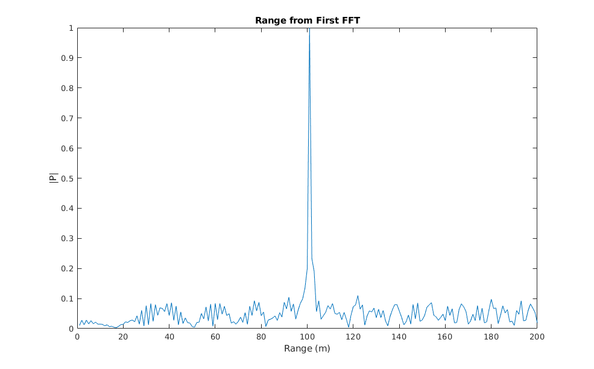
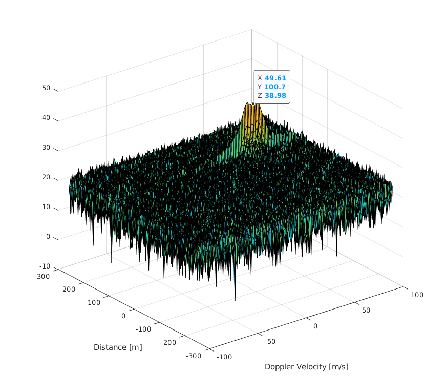
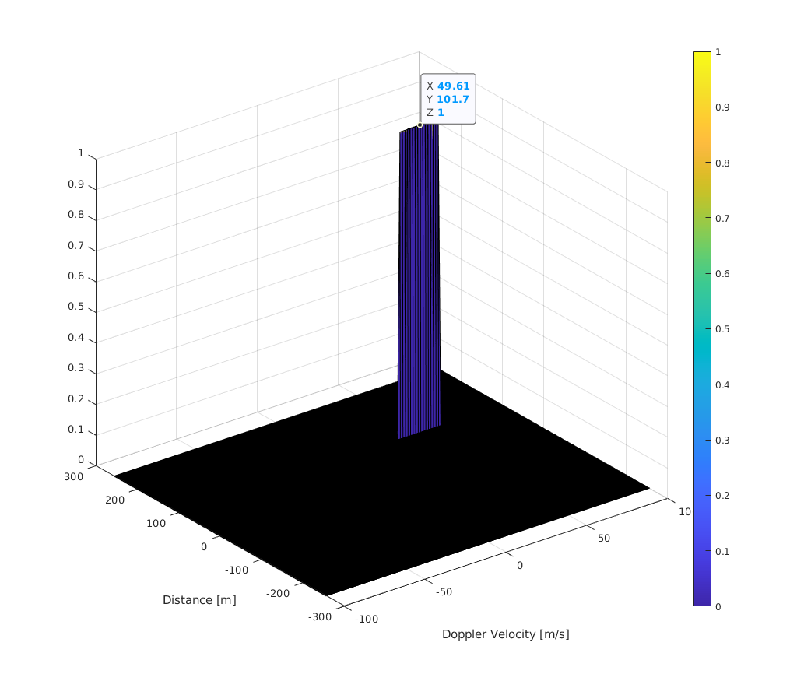

# SFND Radar Detection
Udacity project: Radar target generation and detection


### FMCW Waveform Design
* Bandwidth: 0.15 GHz
* Chirp time: 11 ns
* Chirp slope: 2.0455e+13

### Simulation

The Tx and Rx signal was generated by simulating a moving target from the initial position of 100m at a velocity of 50 m/s.

### Range FFT (1st FFT)
The following plot show the range FFT of the simulated signal, with the peak at ~100m.



### Range and doppler velocity (2D FFT)
With 2D FFT we are able to estimate both the range and the velocity of the target using doppler estimation. There is a high amount of noise, but we can clearly see that the range is 100m with a velocity around 50m/s.


### 2D CFAR
An issue with a noisy signal is where to set the signal threshold to avoid false positives or false negatives. In this project we will use an adaptive threshold using Cell-averaging Constant false alarm rate (CA-CFAR). This method estimate the noise level based on the neighbouring signal cells, where a threshold can be set defined by the estimated noise level and a predefined offset.


#### Selection of Training, Guard cells and offset
* Number of training cells in range axis (Tr): 12
* Number of training cells in doppler axis (Td): 6
* Number of guard cells in range axis (Gr): 6
* Number of guard cells in doppler axis (Gd): 3
* Threshold offset: 8dB

#### Implementation steps for the 2D CFAR process
The 2D CFAR was implemented by sliding a window through the 2D FFT results (Nr x Nd). In each window the noise level was estimated by averaging the signal strength of all the training cells. The signal was then filtered if lower than a threshold defined by the estimated noise level and a set offset. The non-thresholded edge cells that are not estimated are just set to zero in the same loop.
```
training_cells = (2*Tr+2*Gr+1)*(2*Td+2*Gd+1) - (2*Gr+1)*(2*Gd+1);

for i = 1:Nr/2
    for j = 1:Nd
        % Set edge not checked by CUT to zero
        if(i <= Tr+Gr || i >= Nr/2 - Tr-Gr)
            RDM_filtered(i,j) = 0;
            continue
        end
        if(j <= Td+Gd || j >= Nd - Td-Gd)
            RDM_filtered(i,j) = 0;
            continue
        end

        % Estimate the noise level by averaging the signal strength in the
        % training cells
        noise_total_area = sum(db2pow(RDM(i - Tr - Gr: i+Tr + Gr, j - Td - Gd:j+ Td + Gd)),'all');
        noise_guard_area = sum(db2pow(RDM(i - Gr: i + Gd, j-Gd:j+Gd)),'all');   
        noise_level = (noise_total_area - noise_guard_area)/  training_cells;

        threshold = pow2db(noise_level) + offset;

        if (RDM(i, j) <= threshold)
            RDM_filtered(i,j) = 0;
        else
            RDM_filtered(i,j) = 1;
        end    
    end
end

```

The following show the results of the 2D CFAR, where all the noise from the previous plot have been filtered away and converted into a binary signal.

